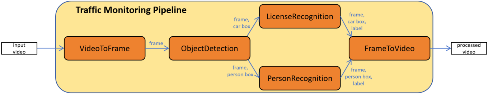

# This is a traffic pipeline project code.
The correct code is stored in [lifang535/traffic](https://github.com/lifang535/traffic/tree/master).
  
Mainly including **VideoToFrame, ObjectDetection, LicenseRecognition, PersonRecognition, and FrameToVideo.**  



## Traffic Monitoring Pipeline

The modules are in `traffic/module`:

- `VideoToFrame`: Extracts frames from video, and sends them to `ObjectDetection`.
- `ObjectDetection`: Detects cars and persons, and sends them with boxes to `LicenseRecognition` and `PersonRecognition` respectively.
- `LicenseRecognition`: Reads the text in the box of the frame, and sends frame with box and label to `FrameToVideo`.
- `PersonRecognition`: Recognizes the face in the box of the frame, and sends frame with box and label to `FrameToVideo`.
- `FrameToVideo`: Collects frames with boxes and labels, and combines them into a video.

## Model Source

- `ObjectDetection`: [YOLOs Tiny](https://huggingface.co/hustvl/yolos-tiny)
- `LicenseRecognition`: [EasyOCR](https://github.com/JaidedAI/EasyOCR)
- `PersonRecognition`: [Face Recognition](https://github.com/ageitgey/face_recognition/tree/master)

## Quick Start

Install the required libraries:

``` bash
$ pip3 install -r requirements.txt
```

Adjust configuration in `traffic/module/configs.py`.  

Execute:

``` bash
$ cd module
$ python3 pipeline.py
```

Then, the pipeline will read the videos from `traffic/input_video`, process them, and save the processed videos in `traffic/output_video`.

## Docker

### Search for the Docker image:

``` bash
$ docker search traffic_monitoring_pipeline
```

### Pull the image:

``` bash
$ docker pull lifang535/traffic_monitoring_pipeline_with_git_v3
```

### Create and run the container:

``` bash
$ docker run --gpus all -it --rm --name temp traffic_monitoring_pipeline_with_git_v3
```

### Execute the pipeline:

All dependencies have been installed. Execute the following commands:

``` bash
$ cd module
$ python3 pipeline.py
```
